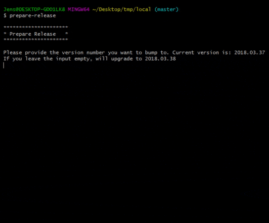

# hippo-sh-tools
Command line tools for release preparation automation.
This set of tools takes care of the hassle of 1-upping your Hippo project version, changing the bootstrap files that go with it, tagging the release in git. All without typos or mistakes.

This tool will:
1. Read your maven version
2. Suggest what would be the next version number (you can manually change this)
3. Change the maven versions in all your project's pom.xml files
4. Look for the previous version in the `bootstrap` folder of your project and replace the old version with the new version
5. Commit all changes in git
6. (optionally) Tag this commit with the same version number using the format `release/RELEASE_NUMBER`
7. (optionally) Build your release artifact (mvn clean verify && mvn -Pdist)
8. Push the changes to your remote Git repository

## Usage
```
prepare-release
```


## Getting Started

### Prerequisites
These tools should be ran in a bash environment. Recommended to use [Git Bash](https://git-scm.com) when using Windows.

### Installation
```
# Clone this repo
git clone https://github.com/jenskooij/hippo-sh-tools.git
# Add to path
PATH=$PATH:$(pwd)/hippo-sh-tools
# Navigate to your Hippo project's root folder
# Run
release-prepare.sh
```

_Note:_ In case of Windows, you will want to add the source directory of hippo-sh-tools to your Path environment variable through the Windows interface.

It's also possible to create an alias for the executable, in your ~/.bashrc by adding the following line:
```
alias prepare-release='/path/to/source/hippo-sh-tools/prepare-release.sh'
```

### Usage of individual tools
Run tools from bash

#### Version Bump
```
$ ./version-bump.sh new_version
```

#### Upgrade Bootstrap
```
$ ./upgrade-bootstrap.sh old_version new_version
```

#### Release Prepare
```
$ ./prepare-release.sh
```

## Authors

* **Jens Kooij** - *Initial work* - [jenskooij](https://github.com/jenskooij)

See also the list of [contributors](https://github.com/jenskooij/hippo-sh-tools) who participated in this project.

## License

This project is licensed under the MIT License - see the [LICENSE.md](LICENSE.md) file for details